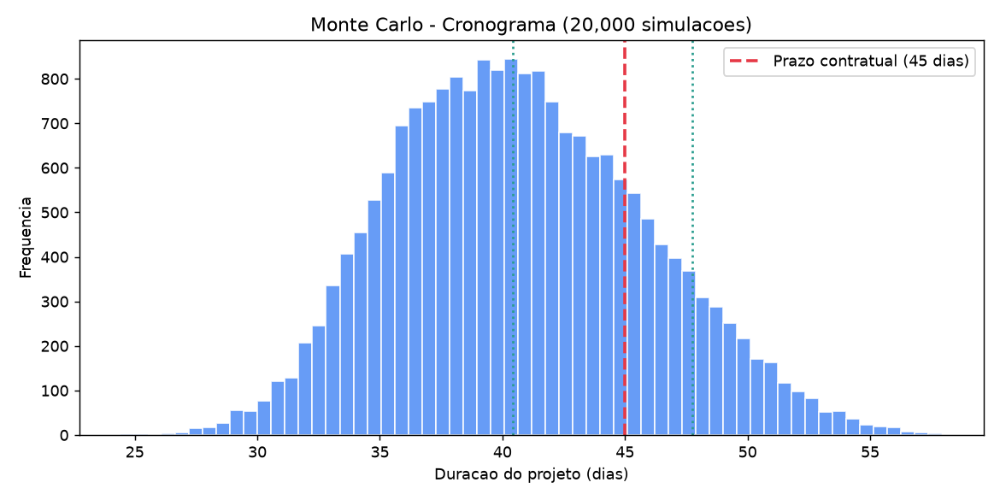
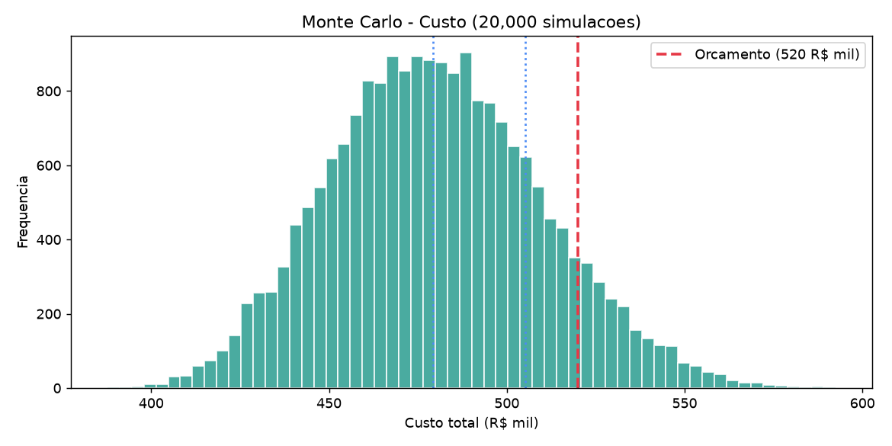

# Monte Carlo para Gerenciamento de Projetos


Simulação de **Monte Carlo aplicada a cronograma e custo de projetos**,
com exportação direta para o **MS Project** (Project XML / MSPDI).

O exemplo embutido é realista: fabricação de **2 trocadores de calor
casco-e-tubo** (caldeiraria, padrão ASME) para cliente Petrobras — mas a
lógica serve para qualquer projeto com estimativas de 3 pontos.

## O que os scripts fazem

| Script | Função |
|---|---|
| `main.py` | **Pipeline Inteligente Completo:** lê documentos (.md) de `/convertidos`, extrai escopo/prazos/custos, aplica a EAP ponderada (2%, 20%, 30%, 40%, 7%, 1%), cria predecessoras inteligentes, roda Monte Carlo (20.000 iterações) e exporta para MS Project XML e relatório executivo |
| `mc_engine.py` | Motor genérico de Simulação de Monte Carlo para redes WBS arbitrárias com distribuição triangular, cálculo de caminho crítico dinâmico, percentis (P10/P50/P80/P90), índice de criticidade e contingência |
| `wbs_scheduler.py` | Gerador e balanceador da EAP padrão por pesos de serviço e distribuidor de durações de 3 pontos com links FS |
| `msproject_exporter.py` | Exportador hierárquico para MS Project XML (MSPDI) com tarefas-resumo, subtarefas e campos customizados Text1..Text5 |
| `projeto_extractor.py` | Extrator semântico de documentos contratuais/técnicos (.md) |
| `mc_projetos.py` | Exemplo inicial isolado de Monte Carlo para 2 trocadores de calor |
| `gerar_msproject.py` | Gerador de XML isolado para o exemplo inicial de trocadores |
| `openproject_to_xml.py` | Integração direta com a API v3 do **OpenProject** |

## Resultados (cronograma)



```
 Duracao do projeto (dias):
   Media:   40.7 | P10:  34.3 | P50:  40.4 | P90:  47.7
 P(terminar <= 45 dias):  78.9%
 P(estourar > 50 dias):   4.5%

 Indice de criticidade (caminho critico em % das simulacoes):
   A Detalhamento / desenhos de fabricacao       100.0%
   B Compra de materiais (casco, espelhos, tubos) 100.0%
   E Montagem do feixe tubular (expansao)          3.7%
```

## Resultados (custo)



```
 Custo total (R$ mil):
   Media: 480.2 | P50: 479.2 | P80: 505.3 | P90: 519.7
 Contingencia sugerida (P80 - P50): R$ 26.1 mil
 P(estourar o orcamento de 520): 9.8%
```

## Instalação

```bash
pip install -r requirements.txt
```

## Uso
 
```bash
# 1) Executar o Pipeline Inteligente (Lê /convertidos, estrutura WBS, roda Monte Carlo e gera XML)
python3 main.py

# Opções customizadas do pipeline
python3 main.py --pasta convertidos/ --saida exemplos/cronograma_tanque_tq960.xml --iteracoes 20000

# 2) Rodar o Monte Carlo isolado do exemplo antigo de trocadores
python3 mc_projetos.py

# 3) Gerar cronograma isolado para MS Project (trocadores)
python3 gerar_msproject.py
```

No MS Project: **Arquivo → Abrir** e selecionar o `.xml` (o Project
converta para `.mpp` ao salvar).

## Metodologia

1. **Estimativas de 3 pontos** por atividade: `(otimista, provável, pessimista)`
   — o "pessimista" honesto é onde a incerteza mora (fornecedor atrasando,
   retrabalho de solda, inspeção)
2. **Distribuição triangular** para amostragem (ou PERT/beta para caudas
   mais suaves)
3. **PERT/CPM com forward/backward pass** por iteração → distribuição da
   duração total, caminho crítico por simulação e **índice de criticidade**
   (% das simulações em que a tarefa trava o projeto)
4. **Decisões**: buffer de cronograma (P90 − P50), contingência de custo
   (P80 − P50), atacar as tarefas com maior variância

## Integração OpenProject — limitações honestas

- O OpenProject nativo não tem estimativa de 3 pontos: o script usa
  `estimatedTime` como "provável" e deriva otimista/pessimista (0.7×/1.6×).
  Se o projeto tiver campos customizados, use `--campo-o/--campo-m/--campo-p`.
- Vínculos de precedência não são expostos na API v3 sem consultar relações
  por pacote: por padrão as tarefas são encadeadas em **FS na ordem de
  exibição** (simplificação documentada).

## FAQ

**Por que XML e não `.mpp`?**
`.mpp` é formato binário proprietário da Microsoft — não existe gerador
confiável fora do Windows. O **Project XML (MSPDI)** é o formato oficial de
intercâmbio, aberto nativamente pelo MS Project 2010+. No Windows, também é
possível gerar `.mpp` direto via COM (`pywin32`).

**Por que a duração média (40,7) é maior que o P50 (40,4)?**
A distribuição do projeto tem cauda à direita (atrasos pesam mais que
adiantamentos) — a média é puxada pelos cenários ruins. Por isso o P50/P90
são mais informativos que a média.

**O que é o índice de criticidade?**
Em cada uma das 20.000 simulações, o caminho crítico pode mudar. O índice
diz em quantos % das simulações a tarefa esteve no caminho crítico —
100% = sempre crítica, 3,7% = quase nunca trava o projeto.

## Estrutura

```
mc-gerenciamento-projetos/
├── mc_projetos.py              # simulacao de Monte Carlo
├── gerar_msproject.py          # gerador de Project XML
├── openproject_to_xml.py       # integracao OpenProject -> Project XML
├── requirements.txt
├── assets/                     # histogramas gerados
│   ├── mc_cronograma.png
│   └── mc_custo.png
└── exemplos/
    └── cronograma_trocadores.xml   # cronograma gerado (abrir no MS Project)
```

## Licença

MIT
